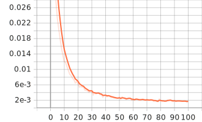
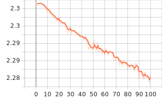
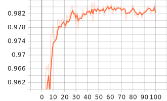

This is the implementation of [_"Training deep neural networks via direct loss minimization"_](http://proceedings.mlr.press/v48/songb16.pdf) published at ICML 2016 in **PyTorch**. The implementation targets the **0-1 loss**.

The repository consists of 3 script files:
1. `main.py`: a demonstration to train MNIST with 0-1 loss
2. `ConvNet.py`: a class defining the architecture of the model used
3. `utils.py`: consists of the function used to estimate the gradient.

One can run the demonstration in `main.py` by copying and modifying (e.g. location to save checkpoints) the command at the top of the script. Here are the results I got when training on MNIST for 100 epochs.
<figure>
    
    <figcaption><b>Figure 1.</b> Training MNIST with 0-1 loss for 100 epochs.</figcaption>
</figure>

 

<figure>
    
    
    <figcaption><b>Figure 2.</b> Testing results evaluated at each epoch: (<i>top</i>) cross-entropy loss, and (<i>bottom</i>) prediction accuracy.</figcaption>
</figure>

If you want to estimate the gradient of 0-1 loss and integrate into your code, please import the `grad_estimation` function in `utils.py`.